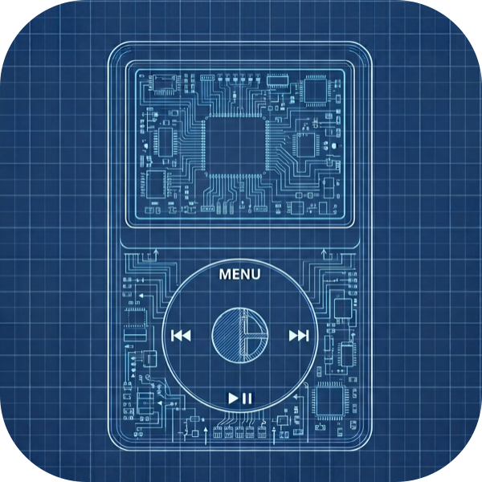

<div align="center">



# Minpod

**Drag-and-drop music onto your click-wheel iPod — no iTunes required.**

A native macOS app that writes directly to the iPod's `iTunesDB`, so you can
add songs (with album art) to an iPod Video, Classic, or Nano just by dropping
files onto a window.

</div>

---

## Why

Modern macOS has no way to put music on an old click-wheel iPod — the Music app
dropped iPod syncing, and what remains tends to wipe the device. Minpod talks to
the iPod's database format directly and **adds** songs without erasing anything.

## Features

- **Drag and drop** — drop files *or whole folders* onto the window; audio is
  copied and added automatically (recursively for folders).
- **Format conversion** — FLAC and other non-iPod formats are transcoded to AAC
  on the fly so they play.
- **Album art** — embedded covers are extracted, converted to the iPod's exact
  thumbnail formats, and shown on the device. Or set a cover manually from any image.
- **Playlists** — create, rename, delete, and add songs to playlists from a sidebar.
- **Edit metadata** — change title/artist/album/genre and star rating in place.
- **Remove & export** — delete songs (and their files), or copy songs back to your Mac.
- **Duplicate detection** — songs already on the iPod are skipped on add.
- **Library + capacity** — sortable track list with ratings/play counts and free-space readout.
- **Safe writes** — the database is backed up before every change and written
  atomically, with the device checksum recomputed so the iPod accepts it.
- **One-click eject** — flush and unmount safely from the toolbar.

## Supported iPods

| Model | Checksum | Status |
| --- | --- | --- |
| iPod Video (5G / 5.5G) | none | ✅ |
| iPod nano 1G / 2G | none | ✅ |
| iPod nano 3G / 4G | hash58 | ✅ |
| iPod Classic (all generations) | hash58 | ✅ |
| iPod nano 5G+ / Touch / iPhone | hash72 / hashAB | ❌ not supported |

## Install / Build

Requires macOS 14+ and the Swift toolchain (Xcode).

```bash
git clone https://github.com/moerdowo/Minpod.git
cd Minpod
./scripts/bundle.sh          # builds build/Minpod.app
open build/Minpod.app
```

Minpod is **not sandboxed** so it can read and write the iPod's removable
volume. On first write, macOS may ask to allow access to files on a removable
volume — approve it.

## Usage

1. Connect your iPod and enable disk use (it mounts at `/Volumes/...`).
2. Open Minpod — it detects the iPod and lists its songs.
3. **Drag audio files onto the window.** They're copied and added immediately.
4. Click **Eject**. The iPod reloads its database and the new songs appear under
   Music. (If they don't show right away, a hard reset — Menu + Select — forces
   the reload.)

## How it works

Putting a song on a click-wheel iPod is much more than copying a file. Minpod
reproduces what iTunes used to do:

- **iTunesDB engine** — a byte-exact parser/serializer for the proprietary
  `iTunesDB` chunk format. It validates by round-tripping the device's real
  database identically before ever writing.
- **hash58 checksum** — iPod Classic / nano 3G+ reject any database whose
  checksum doesn't match. Minpod recomputes the HMAC-SHA1 checksum keyed by the
  device's FireWire GUID.
- **Browse indices** — the iPod renders Songs / Artists / Albums from
  precomputed sort indices (mhod 52/53) on the master playlist, which are
  regenerated on every change.
- **Both master playlists** — the library playlist is mirrored in two datasets;
  Minpod keeps both in sync so added tracks actually appear.
- **Artwork** — covers are scaled and converted to RGB565 thumbnails, appended
  to the `.ithmb` files, and linked into the `ArtworkDB`.

## Limitations

- hash72 / hashAB devices (nano 5G+, Touch, iPhone) aren't supported.
- Smart playlists and on-device playback aren't supported.
- Don't let the Finder/Music app auto-sync the iPod, or it may replace its
  contents. Set the device to "manually manage music."

## Acknowledgements

The iTunesDB / ArtworkDB format details and the hash58 algorithm are based on
the work of the [libgpod](https://gitlab.gnome.org/GNOME/libgpod) project.
iPod and iTunes are trademarks of Apple. Minpod is not affiliated with or
endorsed by Apple.
